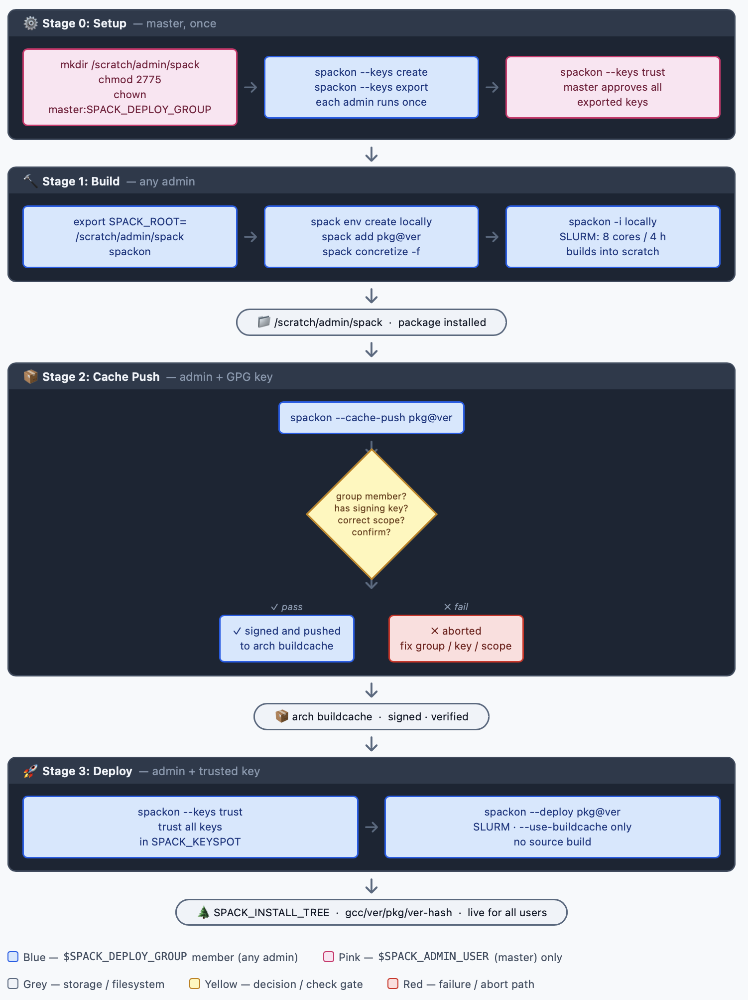

# spackon — Spack Manager for ARCH HPC

### HPC · ARCH · Johns Hopkins University
### Maintainer: Ricardo S Jacomini < ricardo.jacomini @ jhu.edu >
### Date: Jul, 18 2022

> **DISCLAIMER**
> This script is designated for use exclusively by the HPC Scientific Software team 
> within Research Computing at Johns Hopkins University. It remains in the developmental phase. 
> Usage is at your own risk.

---

`spackon` is a bash wrapper around [Spack](https://spack.readthedocs.io) that manages software installation, shared build caches, and GPG-signed deployments to the ARCH shared software stack. It automatically detects the CPU architecture (Intel or AMD) at runtime and selects the matching config scope and install tree.

---

## Table of Contents

- [Quick Start](#quick-start)
- [For Regular Users (non-spack)](#for-regular-users-non-spack)
- [Architecture Overview](#architecture-overview)
- [3-Stage Collaborative Workflow](#3-stage-collaborative-workflow)
  - [Flow Diagram](#flow-diagram)
  - [Stage 0 — One-Time Setup](#stage-0--one-time-setup-${SPACK_ADMIN_USER}-runs-once)
  - [Stage 1 — Build in Scratch Space](#stage-1--build-in-scratch-space-any-admin)
  - [Stage 2 — Push to Shared Cache](#stage-2--push-to-shared-cache-admin--gpg-key)
  - [Stage 3 — Deploy to Install Tree](#stage-3--deploy-to-shared-install-tree-admin--trusted-key)
- [Commands Reference](#commands-reference)
- [Config Scopes](#config-scopes)
- [Mirrors](#mirrors)
- [GPG Key Management](#gpg-key-management)
- [What Keeps install_tree Clean](#what-keeps-install_tree-clean)
- [Admin Operations](#admin-operations-help-admin)

---

## Quick Start

### Activate spack subshell
```bash
spackon
```
### Full help
```bash
help-all
```
### Admin help (`$SPACK_DEPLOY_GROUP` members)
```bash
help-admin
```
### Master help (`$SPACK_ADMIN_USER` only)
```bash
help-master
```

---

## For Regular Users (non-admin)

You do not need to be a member of the `$SPACK_DEPLOY_GROUP` group to use `spackon`. Regular ARCH users can:

1. **Use pre-installed software** — packages deployed by admin are available in the shared module tree without any spack setup.
2. **Install a personal spack** — build and manage your own packages in your home directory.
3. **Build packages locally** — submit SLURM jobs to compile packages into your personal spack.

### Use Pre-installed Packages

Software deployed by admins is available via the module system. No spack interaction required:

```bash
module avail           - list all available software
module load gcc/9.3.0 python/3.11.9
python --version
```

### Install Your Own Spack

If you need a package not available in the module system, you can install your own spack:

### Install spack into ~/software_spack
```bash
spackon -c
```
### Activate your personal spack subshell
```bash
spackon
```

### Build Packages in Your Personal Spack

### Activate spackon
```bash
spackon
```
### Create a local environment
```bash
spack env create myenv
spack env activate myenv
```
### Add packages
```bash
spack add python@3.11.9
spack concretize -f
```
### Submit a SLURM build job (8 cores, 4 hours)
```bash
spackon -i locally
```
Packages install into ~/software_spack — your personal space only

> **Note:** Personal builds do **not** go into the shared install tree (`$SPACK_INSTALL_TREE`).
> If you need a package added to the shared tree, ask a `$SPACK_DEPLOY_GROUP` member.

### Commands Available to All Users

See [Commands Reference](#commands-reference) for the full table with per-role access (Non-admin / Admin / Master).

---

## Architecture Overview

### Runtime Variables

| Variable | Path | Who uses it | Purpose |
|---|---|---|---|
| `$SPACK_INSTALL_DIR` | `/scratch/{affiliation}/{user}/spack` | per user | Personal spack install (non-admin workflow) |
| `$SPACK_SCRATCH` | `/scratch/{affiliation}/admin/spack` | all admins share | Shared admin build area (Stage 1–3 workflow) |
| `$SPACK_SCOPE` | `/apps/helpers/spack/{intel\|amd}` | all | Config scope — auto-set by CPU vendor |
| `$SPACK_INSTALL_TREE` | `/apps/software/spack/{intel\|amd}` | admins | Shared install tree — auto-set by CPU vendor |
| `$SPACK_KEYSPOT` | `/apps/software/spack/build/keys` | admins | GPG public key directory |

> `affiliation` = `jhu` (default) or `schmidt` (users whose login starts with `ssci`)
> Both `$SPACK_INSTALL_DIR` and `$SPACK_SCRATCH` are auto-detected at runtime — no hardcoded paths needed.

### Filesystem Paths

| Path                                          | Purpose/Type              | Notes/Permissions                       |
|-----------------------------------------------|---------------------------|-----------------------------------------|
| `/scratch/jhu/admin/spack`                    | Shared admin build space  | all `$SPACK_DEPLOY_GROUP` write here    |
| `/scratch/jhu/{user}/spack`                   | Personal spack install    | per-user, created by `spackon -c`       |
| `/apps/software/spack/mirror-spack/build_cache` | arch buildcache         | signed: true                            |
| `/apps/software/spack/intel`                  | Shared install_tree (x86) | `$SPACK_DEPLOY_GROUP` write, 2775       |
| `/apps/software/spack/amd`                    | Shared install_tree (AMD) | `$SPACK_DEPLOY_GROUP` write, 2775       |
| `/apps/software/spack/build/keys`             | GPG public keys           | `$SPACK_DEPLOY_GROUP` write, 2775       |

**Config scopes** live in `/apps/helpers/spack/` — shared across all `$SPACK_DEPLOY_GROUP` members:

| Scope   | Config path (`$SPACK_SCOPE`)   | install_tree (`$SPACK_INSTALL_TREE`) | Architecture |
|---------|--------------------------------|--------------------------------------|--------------|
| `intel` | `/apps/helpers/spack/intel`    | `/apps/software/spack/intel`         | intel        |
| `amd`   | `/apps/helpers/spack/amd`      | `/apps/software/spack/amd`           | amd          |

> **`$SPACK_SCOPE`** and **`$SPACK_INSTALL_TREE`** are auto-set by spackon at startup based on CPU vendor (`lscpu`).
> Use `$SPACK_SCOPE` in spack commands instead of hardcoding the path — it works for both intel and AMD nodes.

---

## 3-Stage Collaborative Workflow

### Flow Diagram



 🌐 [Interactive version](flow-diagram.html) — open in browser 

---

### Stage 0 — One-Time Setup 
> #### ${SPACK_ADMIN_USER} runs once, requires sudo

#### Create all shared directories automatically

```bash
sudo -v               # authenticate sudo first
spackon --setup       # creates + chowns + chmods all dirs
```

This creates with `chown ${SPACK_ADMIN_USER}:${SPACK_DEPLOY_GROUP}` and `chmod 2775`:
- `$SPACK_SCRATCH` — shared scratch space for all admin builds
- `$SPACK_INSTALL_TREE` — shared install tree (intel)
- `$SPACK_INSTALL_TREE_AMD` — shared install tree (amd)
- `$SPACK_KEYSPOT` — GPG key directory

#### Verify permissions

```bash
stat /apps/software/spack/intel | grep Access
```
#### Expected: drwxrwsr-x  (2775 with setgid 's' in group bits)

#### Manual equivalent (if needed)

```bash
sudo mkdir -p $SPACK_SCRATCH
sudo chown ${SPACK_ADMIN_USER}:${SPACK_DEPLOY_GROUP} $SPACK_SCRATCH
sudo chmod 2775 $SPACK_SCRATCH
sudo mkdir -p /apps/software/spack/build/keys
sudo chown ${SPACK_ADMIN_USER}:${SPACK_DEPLOY_GROUP} /apps/software/spack/build/keys
sudo chmod 2775 /apps/software/spack/build/keys
```

---

### Stage 0b — Each admin member: key setup (one-time per user)

#### 1. Activate spackon
```bash
spackon
```

#### 2. Create your GPG signing key (DO THIS ONCE ONLY)
##### spack has issues with duplicate keys — see github.com/spack/spack/issues/14720
```bash
spackon --keys create
```
##### Prompts: Full name [jsmith-admin], Email [jsmith@jhu.edu]
##### Press Enter to accept defaults or type your own

#### 3. Export your public key to the shared keyspot
```bash
spackon --keys export
```
##### Creates: /apps/software/spack/build/keys/jsmith-spack-key-compiled-vYYYYMMDD.pub.gpg
##### Creates: ~/jsmith-spack-key-compiled-vYYYYMMDD.priv.gpg  (keep safe!)

#### 4. Tell ${SPACK_ADMIN_USER} to trust your key
##### ${SPACK_ADMIN_USER} runs once to approve:
```bash
spackon --keys trust
```
##### Trusts all public keys in /apps/software/spack/build/keys/

> **Why GPG keys?**
> The `arch` buildcache mirror is configured with `signed: true`.
> Only packages signed with a trusted GPG key can be pushed to or deployed from the cache.
> This prevents unsigned or unverified packages from entering the shared install tree.

---

### Stage 1 — Build in Scratch Space (any admin)

#### Point spack at shared scratch (all admin can write here)
```bash
export SPACK_ROOT=$SPACK_SCRATCH
```

#### Activate spack subshell
```bash
spackon
```

#### Create or activate your environment
```bash
spack env create locally       # first time only
spack env activate locally
```

#### Add packages to your environment

```bash
spack add python@3.11.9 %gcc@9.3.0
spack add openmpi@4.1.6 %gcc@9.3.0
```

#### Concretize — resolve all dependencies

```bash
spack -C $SPACK_SCOPE concretize -f
```

#### Submit build job to SLURM (8 cores, 4 hours)
```bash
spackon -i locally
```

##### Packages land in `$SPACK_SCRATCH` — shared admin scratch space
##### Nothing touches the shared install_tree yet

> **Tip:** Use `spack -C $SPACK_SCOPE concretize` to ensure packages resolve against the same
> config that will be used at deploy time (`$SPACK_SCOPE` is auto-set to intel or amd scope).

---

### Stage 2 — Push to Shared Cache (admin + GPG key)

#### After SLURM job completes and package is installed
```bash
spackon --cache-push python@3.11.9
```

spackon performs these checks automatically before pushing:

1. **group membership** — must be in `$SPACK_DEPLOY_GROUP` group
2. **GPG key present** — must have run `spackon --keys create`
3. **intel scope check** — package must have been built with intel config
   *(wrong compiler/variants won't match the shared install_tree projections)*
4. **Dry-run preview** — shows exactly what will be pushed
5. **Confirmation prompt** — requires explicit `yes` before signing and pushing

```
==> Dry-run: packages to push to arch cache:
    python@3.11.9 %gcc@9.3.0 arch=linux-rocky8-x86_64 /abc1234

Push to arch buildcache? (yes/no): yes
==> Done. Other admin users can deploy with: spackon --deploy python@3.11.9
```

#### Push an entire environment

```bash
spackon --cache-push --env locally
```
##### Shows all packages in the 'locally' env, asks for confirmation once

---

### Stage 3 — Deploy to Shared Install Tree (admin + trusted key)

#### Make sure you trust all admin keys first
```bash
spackon --keys trust
```
#### Deploy from signed cache → $SPACK_INSTALL_TREE
```bash
spackon --deploy python@3.11.9
```

**What happens:**

- Submits a SLURM job running:
  `spack -C $SPACK_SCOPE install --use-buildcache only python@3.11.9`
- `--use-buildcache only` means **no source compilation** — if the package is not in the signed cache, the job fails
- Package installs into `/apps/software/spack/intel/gcc/9.3.0/python/3.11.9-abc1234`
- Path is enforced by projections: `{compiler.name}/{compiler.version}/{name}/{version}-{hash:7}`

#### Deploy an entire environment

```bash
spackon --deploy --env locally
```
##### Deploys all packages in the 'locally' env from cache


> **Why `--use-buildcache only`?**
> Prevents accidental source builds directly into the shared tree.
> Every package in the install tree came from a reviewed, signed cache entry — no surprises.

---

## Commands Reference

| Command | Description | Non-admin | Admin (`$SPACK_DEPLOY_GROUP`) | Master (`$SPACK_ADMIN_USER`) |
|---|---|:---:|:---:|:---:|
| `spackon` | Activate spack subshell | ✅ | ✅ | ✅ |
| `spackon -c` | Install spack in `~/software_spack` | ✅ | ✅ | ✅ |
| `spackon -i locally` | Build packages in personal spack (SLURM) | ✅ | ✅ | ✅ |
| `spackon -u` | Update spack to latest stable release | ✅ | ✅ | ✅ |
| `spackon -u dev` | Update spack to develop branch | ✅ | ✅ | ✅ |
| `spackon --keys list` | List current GPG keys | ✅ | ✅ | ✅ |
| `spackon --keys trust` | Trust all keys in `$SPACK_KEYSPOT` (required before using cache) | ✅ | ✅ | ✅ |
| `spack install --use-buildcache prefer <pkg>` | Install from shared cache, build if not cached | ✅ | ✅ | ✅ |
| `spack buildcache list <pkg>` | Search shared cache for a package | ✅ | ✅ | ✅ |
| `help-all` | Full help inside spackon subshell | ✅ | ✅ | ✅ |
| `spackon --keys create` | Create GPG signing key (once per user) | ❌ | ✅ | ✅ |
| `spackon --keys export` | Export public key to `$SPACK_KEYSPOT` | ❌ | ✅ | ✅ |
| `spackon -i -arch` | Build directly into shared install_tree (SLURM) | ❌ | ✅ | ✅ |
| `spackon --cache-push <pkg>@<ver>` | Push signed package to arch cache | ❌ | ✅ | ✅ |
| `spackon --cache-push --env <env>` | Push all packages in env to cache | ❌ | ✅ | ✅ |
| `spackon --deploy <pkg>@<ver>` | Deploy from cache → `$SPACK_INSTALL_TREE` (SLURM) | ❌ | ✅ | ✅ |
| `spackon --deploy --env <env>` | Deploy full env from cache (SLURM) | ❌ | ✅ | ✅ |
| `help-admin` | Admin operations help | ❌ | ✅ | ✅ |
| `spackon -i -push` | Install locally + push to cache (SLURM) | ❌ | ❌ | ✅ |
| `spackon -i -arch-push` | Install into shared tree + push to cache (SLURM) | ❌ | ❌ | ✅ |
| `spackon --setup` | Create all shared dirs with correct ownership (requires sudo) | ❌ | ❌ | ✅ |
| `help-master` | Master-only operations help | ❌ | ❌ | ✅ |

---

## Config Scopes

Config scopes live in `/apps/helpers/spack/` — shared across all admin, preserved across spack updates.

### Verify install_tree config

```bash
spack -C $SPACK_SCOPE config get config
```

### Find installed packages
```bash
spack -C $SPACK_SCOPE find -pl
```

### Concretize environment
```bash
spack -C $SPACK_SCOPE concretize -f
```

### Build manually (debug)
```bash
spack -ddd -C $SPACK_SCOPE install -j 8
```

Key settings in `intel/config.yaml`:

```yaml
config:
  install_tree:
    root: /apps/software/spack/intel
    projections:
      all: "{compiler.name}/{compiler.version}/{name}/{version}-{hash:7}"
  locks: true               - prevent DB corruption during concurrent builds
  db_lock_timeout: 120      - wait up to 120s for lock before failing
  build_jobs: 8
```

---

## Mirrors

Mirror paths are configured in one place: `/apps/helpers/spack/init`
To change a path, edit `init` — all users and spackon pick it up automatically.

| Mirror         | Path                                                | Signed | Status                                     |
|----------------|-----------------------------------------------------|--------|--------------------------------------------|
| `spack-public` | `https://mirror.spack.io`                           | yes    | upstream public cache                      |
| `arch`         | `/apps/software/spack/mirror-spack/build_cache`     | yes    | active RF build cache — all builds go here |

#### List active mirrors
```bash
spack -C $SPACK_SCOPE mirror list
```

#### Search buildcache (checks all mirrors)
```bash
spack -C $SPACK_SCOPE buildcache list python
```

#### Push new build to arch (admin + GPG key required)
```bash
spackon --cache-push python@3.11.9
```

#### Check permissions on arch mirror
```bash
stat /apps/software/spack/mirror-spack/build_cache | grep -E 'Uid|Gid|Access:'
```
#### Expected: ${SPACK_ADMIN_USER}:${SPACK_DEPLOY_GROUP}  2775 (drwxrwsr-x)

> `arch` is the single active mirror — all new builds push here.
> `signed: true` enforces GPG verification before any package enters the shared install_tree.

---

## GPG Key Management

```
/apps/software/spack/build/keys/
├── ${SPACK_ADMIN_USER}-spack-key-compiled-v20260318.pub.gpg
├── jsmith-spack-key-compiled-v20260401.pub.gpg
└── ...
```

#### Create key (admin, once per user)
```bash
spackon --keys create
```

#### Export to shared keyspot (after create)
```bash
spackon --keys export
```

#### Trust all exported keys (run by anyone who needs to deploy)
```bash
spackon --keys trust
```

#### List trusted keys
```bash
spackon --keys list
```

#### Manual trust (spack native)
```bash
spack -C $SPACK_SCOPE buildcache keys --install --trust
```

---

## What Keeps install_tree Clean

| Risk                              | Protection                                                                          |
|-----------------------------------|-------------------------------------------------------------------------------------|
| Broken build lands in tree        | `--use-buildcache only` — only pre-built binaries deploy, no source compilation     |
| Unsigned package sneaks in        | `signed: true` on `arch` mirror — spack rejects unsigned cache entries              |
| Wrong config / compiler variants  | intel scope check in `--cache-push` — rejects packages not built under intel scope  |
| Accidental blanket push           | `--cache-push` requires explicit `<pkg>@<ver>` or `--env` — no push-everything      |
| Unreviewed push                   | Dry-run preview + confirmation prompt before every `--cache-push`                   |
| Concurrent install corruption     | `locks: true`, `db_lock_timeout: 120` in `config.yaml`                             |
| Random user writes to tree        | `chmod 2775` + `$SPACK_DEPLOY_GROUP` group ownership — non-members cannot write     |

---

## Admin Operations (`help-admin`)

> These operations are for ${SPACK_ADMIN_USER} / admin members. No `sudo` needed except where noted.


### Layer 1 — Filesystem security

#### Lock install_tree: `$SPACK_DEPLOY_GROUP` group write, world read (run once)
```bash
chmod 2755 /apps/software/spack/intel          - ${SPACK_ADMIN_USER}-only write
chmod 2755 /apps/software/spack/amd
```

##### OR
```bash
chmod 2775 /apps/software/spack/intel          - $SPACK_DEPLOY_GROUP group write (collaborative)
chmod 2775 /apps/software/spack/amd
```

#### Verify setgid (look for 's' in group bits → drwxrwsr-x)
```bash
stat /apps/software/spack/intel | grep Access
```

#### Fix ownership if needed
```bash
chown -R ${SPACK_ADMIN_USER}:${SPACK_DEPLOY_GROUP} /apps/software/spack/intel
find /apps/software/spack/intel -type d -exec chmod g+s {} \;
```


### Layer 2 — Spack mirror security

Both scopes share the same `arch` buildcache and need identical `mirrors.yaml`.
Set `signed: true` in both `/apps/helpers/spack/intel/mirrors.yaml` and `/apps/helpers/spack/amd/mirrors.yaml`:

```yaml
mirrors:
  arch:
    url: file:///apps/software/spack/mirror-spack/build_cache
    signed: true    # ← requires GPG-signed packages
```

### umask

The spackon subshell sets `umask 0002` automatically — new files created during installs
inherit the `$SPACK_DEPLOY_GROUP` group and are group-writable.

---

## CI vs SLURM: Build Cache Approach

> **Note — to evaluate:** The [Spack tutorial's CI approach](https://spack-tutorial.readthedocs.io/en/latest/tutorial_binary_cache.html)
> (`spack/setup-spack@v2` GitHub Action with an automatic shared binary cache) is a different paradigm —
> it is designed for ephemeral CI runners, not a shared HPC install tree. These two approaches are not
> directly comparable. **We need to evaluate whether a SLURM-based workflow (current) or a CI-driven
> workflow is the right long-term model for ARCH.**

---

## Identifying Intel vs AMD via Modulefile

The module system detects the CPU vendor at load time using `lscpu` and selects the appropriate spack scope automatically:

```lua
-- Capture CPU vendor using lscpu and check for Intel or AMD
local vendor = capture("lscpu | grep 'Vendor ID' | awk '{print $3}'")

if vendor:match("GenuineIntel") then
  -- If CPU is Intel, load the appropriate module
  load("lmod/8.7.37")

elseif vendor:match("AuthenticAMD") then
  -- If CPU is AMD, set the environment variable and load AMD-specific modules
  setenv("LMOD_IGNORE_CACHE", 1)
  load("lmod/8.7.37-AMD")
end
```

This means:
- On Intel nodes → `lmod/8.7.37` is loaded → spack uses `/apps/helpers/spack/intel` scope → installs into `/apps/software/spack/intel`
- On AMD nodes → `lmod/8.7.37-AMD` is loaded → spack uses `/apps/helpers/spack/amd` scope → installs into `/apps/software/spack/amd`

Users do not need to select the scope manually — the modulefile handles it based on the node's CPU.

---

## See Also

- [Spack documentation](https://spack.readthedocs.io)
- [Spack buildcache guide](https://spack.readthedocs.io/en/latest/binary_caches.html)
- [Spack GPG signing](https://spack.readthedocs.io/en/latest/binary_caches.html#signing-and-trusting-keys)
- `~/scripts/overspack/` — ARCH internal build workflow (source of GPG key pattern)
